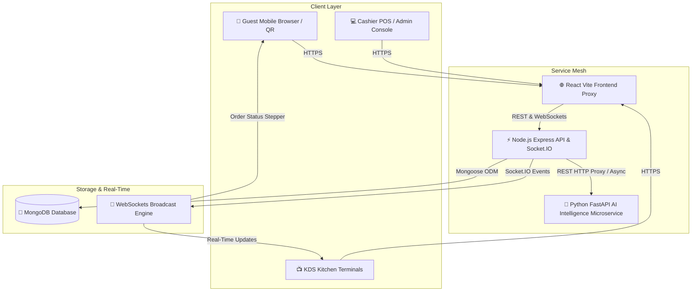

# 🍽️ DineSync AI — Intelligent Multi-Tenant Restaurant Ecosystem

[](https://nodejs.org/)
[](https://expressjs.com/)
[](https://react.dev/)
[](https://fastapi.tiangolo.com/)
[](https://www.mongodb.com/)
[](LICENSE)

> **DineSync AI** is an enterprise-grade, multi-tenant restaurant management ecosystem built with modern web technologies. It seamlessly unifies **POS Billing**, **Real-Time KDS (Kitchen Display System)**, **QR Code Guest Self-Ordering**, **CRM & Loyalty Programs**, **Inventory Ledger**, **Reservation AI Concierge**, and **Predictive AI Intelligence** into a single cohesive platform.

---

## 📌 Architecture Overview



---

## 🚀 Key Feature Highlights

### 🛍️ POS & Bill Splitting
* **POS Register**: Rapid menu navigation, item modifier customization, and basket sidebar drawer.
* **Smart Bill Calculations**: Dynamic GST item taxation, 5% service charges, discounts, and auto-rounding.
* **Flexible Bill Operations**: Equal guest splits, itemized bill splits, and multi-ticket order merging.

### 🍳 Kitchen Display System (KDS)
* **Automated Ticket Routing**: Confirmed orders auto-split across dedicated kitchen stations (Main Kitchen, Bar, Tandoor, Bakery, Beverage).
* **Drag & Drop Kanban**: Visual stage shifts (*Pending* ➔ *In Prep* ➔ *Ready*) with ticking elapsed prep timers.

### 📱 Customer QR Self-Ordering
* **Zero-Login Ordering**: Table & Takeaway QR scanning with real-time menu browsing and dietary filters.
* **Live Stepper Tracking**: WebSocket-driven live order status progress bar (*Accepted* ➔ *Preparing* ➔ *Ready* ➔ *Served*).
* **Self-Checkout**: Digital payments (UPI, Card, Cash) with automated thermal e-receipts.

### 🤖 SmartDine Reservation AI Services
* **NLU Slot Parser (`POST /reservations/ai-parse`)**: Converts plain-English queries (e.g. *"Book a table for 4 guests tomorrow at 8pm, window seat please"*) into structured booking slots and auto-selects available table documents.
* **Time Slot Congestion Recommender (`GET /reservations/ai-slots`)**: Evaluates active floor traffic and peak windows ($19:00 - 21:00$) to recommend non-congested, chef-recommended reservation slots.
* **Recurring Weekly Auto-Booking Engine (`POST /reservations/recurring`)**: Automatically creates upcoming weekly table bookings, locks tables, and dispatches staff notifications every Monday at 8 AM.
* **Automated 30s Table Monitor Loop**: Dynamic 15-minute pre-arrival table locking (`"Reserved"`) and 15-minute post-arrival no-show auto-cancellation (`"No Show"` & table release to `"Available"`).

### 🧠 Predictive AI Intelligence Engine
* **Sales & Revenue Forecast**: Facebook Prophet time-series modeling (7-day & 30-day horizons) with prediction uncertainty spread confidence scoring.
* **Demand & Volume Forecast**: Scikit-learn `RandomForestRegressor` peak hour ($12\text{ PM} - 11\text{ PM}$) and day traffic classification.
* **Inventory Depletion Forecast**: LinearRegression stock consumption trend velocity analysis & auto-reorder recommendations.
* **Food Waste Prevention**: XGBoost `XGBClassifier` overstock & expiry risk classification (**High**, **Medium**, **Low**).
* **Smart Menu Matrix**: Automatic dish categorization (*Best Sellers*, *Seasonal Favorites*, *Underperforming Items*).
* **NLP Sentiment Scoring**: Pretrained DistilBERT transformer analysis on diner reviews & feedback ratings.

---

## 🤖 Workspace AI Maintainer Agents (`.agents/skills/`)

DineSync AI includes 4 workspace maintainer agents that continuously monitor, audit, and benchmark all AI services:

| Agent / Skill Name | Description & Audit Responsibilities |
| :--- | :--- |
| **`ai-health-monitor`** | Audits FastAPI `/api/v1/health` connectivity, Node.js proxy timeout (2000ms), `GEMINI_API_KEY`, and `HF_TOKEN` environment configs. |
| **`ai-sales-demand-maintainer`** | Audits Prophet sales fitting ($\ge 14$ daily sales requirement) and `RandomForestRegressor` peak traffic classifications. |
| **`ai-chatbot-reservation-maintainer`** | Audits 5-tier Gemini model retry cascade, NLU slot parsing, recurring weekly auto-bookings, and 30s table buffer lock & no-show cycle. |
| **`ai-inventory-waste-maintainer`** | Audits `LinearRegression` stock exhaustion slopes, `XGBClassifier` perishable risk levels, and 100% deterministic allergen safety filters. |

### 🛠️ How to Verify Agent Functionality

You can verify that all agents and AI services are working properly using 3 methods:

1. **Ask Antigravity in Chat (Automatic Skill Activation)**:
   * `"Run AI health monitor"`
   * `"Audit sales and demand forecasting models"`
   * `"Check chatbot reservation maintainer"`
   * `"Verify inventory waste and allergen safety rules"`

2. **Run Terminal Verification Commands**:
   ```powershell
   # 1. Test Python ML Libraries
   python -c "import sklearn, xgboost, pandas, numpy; print('✅ ML Stack OK')"

   # 2. Test FastAPI NLU Booking Parser (Native PowerShell cmdlet)
   Invoke-RestMethod -Uri "http://localhost:8000/api/v1/reservation/parse" -Method Post -ContentType "application/json" -Body '{"query":"Book a table for 4 guests tomorrow at 8pm, window seat"}' | ConvertTo-Json

   # 3. Test Time Slot Recommender (Native PowerShell cmdlet)
   Invoke-RestMethod -Uri "http://localhost:8000/api/v1/reservation/recommend-slots" -Method Post -ContentType "application/json" -Body '{"reservation_date":"2026-09-08","party_size":4}' | ConvertTo-Json
   ```


3. **Verify 2-Tier Automatic Failover**:
   * Stop the Python FastAPI microservice (or unset `GEMINI_API_KEY`).
   * Trigger an AI endpoint — the system will automatically return `execution_mode: "HEURISTIC_FALLBACK"` without crashing.

---

## 🛠️ Tech Stack

| Component | Stack & Tools | Description |
| :--- | :--- | :--- |
| **Frontend** | React 18, Vite, Tailwind CSS, shadcn/ui, Recharts, Axios, Socket.IO Client | Responsive SPA with Dark/Light modes & dashboard visualizations |
| **Backend API** | Node.js, Express.js, MongoDB (Mongoose), Socket.IO, Nodemailer, Node-cron | Clean Architecture REST API with real-time WebSocket event dispatching |
| **AI Microservice** | Python 3.10+, FastAPI, PyData Stack (Prophet, XGBoost, Scikit-learn, HuggingFace), Uvicorn | High-performance microservice providing predictive models, NLU & NLP |

---

## 🔑 Quick Test Credentials & Database Seeding

Run the automated seed script to generate a pre-configured demo restaurant and accounts across all roles:

```bash
cd backend
npm run seed
```

### Seeded Credentials (Password for all: `Demo@1234`)

| Role | Portal / Login Page | Email | Access Scope |
| :--- | :--- | :--- | :--- |
| **Owner** | Restaurant Team (`/login/restaurant`) | `owner@demo.dinesync.ai` | Full Restaurant Admin, Billing, Settings, Reports, Employee Payroll |
| **Manager** | Restaurant Team (`/login/restaurant`) | `manager@demo.dinesync.ai` | Operations, Orders, Menu, Tables, Feedback Management, Employee Roster |
| **Staff** | Restaurant Team (`/login/restaurant`) | `staff@demo.dinesync.ai` | Active Seating, POS Order Creation, Serviced Ticket Updates |
| **Chef** | Kitchen Staff (`/login/kitchen`) | `chef@demo.dinesync.ai` | Touch KDS Kitchen Display Console |
| **Super Admin** | Platform Admin (`/login/admin`) | `admin@dinesync.ai` | SaaS Platform Administration *(Direct URL)* |

---

## 📚 API Endpoints Summary

<details>
<summary><b>🔍 Expand to view major API Endpoint routes</b></summary>

<br />

| Module | Base Path | Description |
| :--- | :--- | :--- |
| **Auth & Tenants** | `/api/v1/auth` | Tenant registration, user auth & JWT verification |
| **Catalog** | `/api/v1/restaurants/:id/categories` | Categories & Menu items management |
| **Tables & QR** | `/api/v1/restaurants/:id/tables` | Seating layout & QR code generation |
| **Reservations AI** | `/api/v1/restaurants/:id/reservations` | NLU slot parsing, recurring weekly auto-bookings & time slot recommendations |
| **POS & Orders** | `/api/v1/restaurants/:id/orders` | Order creation, item modifiers, bill splitting |
| **Kitchen (KDS)** | `/api/v1/restaurants/:id/kitchen` | Kitchen ticket status tracking & station logs |
| **Inventory** | `/api/v1/restaurants/:id/inventory` | Ingredient balances, purchase invoices & stock adjustments |
| **CRM & Loyalty** | `/api/v1/restaurants/:id/customers` | Patron profiles, points accrual & redemptions |
| **Employee & Payroll**| `/api/v1/restaurants/:id/employees` | Clock-in/out, roster shifts & monthly payroll |
| **AI Intelligence** | `/api/v1/restaurants/:id/ai` | Sales forecast, smart menu, sentiment analysis |
| **Public QR Platform**| `/api/v1/public/restaurants/:id` | Guest self-ordering menu, live tracking & self-checkout |
| **Super Admin** | `/api/v1/super-admin` | Platform MRR, SaaS tenant management & health monitoring |

</details>

---

## ⚡ Redis Infrastructure Setup & Graceful Degradation

Redis is used for short-lived, high-frequency state management (atomic table-locking, OTP storage & rate-limiting, and Socket.IO multi-node broadcasting). **Redis does NOT store durable business data** (MongoDB remains the system of record).

### Required Environment Variables

| Variable | Local | Staging | Production | Default |
| :--- | :--- | :--- | :--- | :--- |
| `REDIS_URI` / `REDIS_URL` | `redis://127.0.0.1:6379` | `rediss://:pass@staging-redis-host:6379` | `rediss://:pass@prod-redis-host:6379` | `redis://127.0.0.1:6379` |
| `OTP_MAX_SEND_PER_HOUR` | `5` | `5` | `5` | `5` |
| `OTP_MAX_SEND_PER_TABLE_PER_HOUR` | `10` | `10` | `10` | `10` |
| `OTP_MAX_VERIFY_ATTEMPTS` | `5` | `5` | `5` | `5` |

### Graceful Degradation & Resilience (Tested Offline)

If Redis becomes unreachable or stopped in any environment:
- **Application Uptime**: Node.js backend emits a warning log (`[Redis Degraded Mode]`) and remains **100% operational** without crashing.
- **Table Locking**: **Fails Safe**. Falls back to atomic in-memory lock maps on the Node instance, preventing double-Host QR scan race conditions.
- **OTP & Rate Limiting**: **Fails Open**. Uses local memory counters and MongoDB OTP validation so legitimate guests are never locked out of logging in.
- **Socket.IO Scaling**: **Fails Local**. Automatically falls back to in-memory Socket.IO event broadcasting.

---

## 🛡️ Environment & Security Notes

> [!IMPORTANT]
> All sensitive environment files (`.env`, `.env.*`), Docker configs, API keys, and certificates are strictly kept out of version control via comprehensive `.gitignore` rules and workspace policies. Ensure you configure your local `.env` files using `.env.example` templates prior to starting services.

---

## 📝 License

Distributed under the **MIT License**. See `LICENSE` for more details.