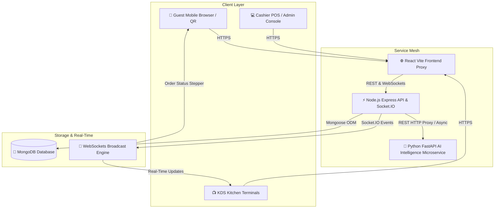

# 🍽️ DineSync AI — Intelligent Multi-Tenant Restaurant Ecosystem

[](https://nodejs.org/)
[](https://expressjs.com/)
[](https://react.dev/)
[](https://fastapi.tiangolo.com/)
[](https://www.mongodb.com/)
[](LICENSE)

> **DineSync AI** is an enterprise-grade, multi-tenant restaurant management ecosystem built with modern web technologies. It seamlessly unifies **POS Billing**, **Real-Time KDS (Kitchen Display System)**, **QR Code Guest Self-Ordering**, **CRM & Loyalty Programs**, **Inventory Ledger**, and **Predictive AI Intelligence** into a single cohesive platform.

---

## 📌 Architecture Overview



---

## 🚀 Key Feature Highlights

### 🛍️ POS & Bill Splitting
* **POS Register**: Rapid menu navigation, item modifier customization, and basket sidebar drawer.
* **Smart Bill Calculations**: Dynamic GST item taxation, 5% service charges, discounts, and auto-rounding.
* **Flexible Bill Operations**: Equal guest splits, itemized bill splits, and multi-ticket order merging.

### 🍳 Kitchen Display System (KDS)
* **Automated Ticket Routing**: Confirmed orders auto-split across dedicated kitchen stations (Main Kitchen, Bar, Tandoor, Bakery, Beverage).
* **Drag & Drop Kanban**: Visual stage shifts (*Pending* ➔ *In Prep* ➔ *Ready*) with ticking elapsed prep timers.

### 📱 Customer QR Self-Ordering
* **Zero-Login Ordering**: Table & Takeaway QR scanning with real-time menu browsing and dietary filters.
* **Live Stepper Tracking**: WebSocket-driven live order status progress bar (*Accepted* ➔ *Preparing* ➔ *Ready* ➔ *Served*).
* **Self-Checkout**: Digital payments (UPI, Card, Cash) with automated thermal e-receipts.

### 🧠 Predictive AI Intelligence Engine
* **Sales & Revenue Forecast**: Predictive revenue modeling (7-day & 30-day forecast horizons) with confidence metrics.
* **Inventory Depletion Forecast**: Smart stock consumption velocity analysis & auto-reorder recommendations.
* **Smart Menu Matrix**: Automatic dish categorization (*Best Sellers*, *Seasonal Favorites*, *Underperforming Items*).
* **NLP Sentiment Scoring**: Automatic AI sentiment analysis on customer reviews & feedback ratings.

### 📦 Inventory & Vendor Management
* **Recipe-Based Auto Consumption**: Instant ingredient decrementing upon kitchen ticket completion.
* **Vendor Ledger & Purchase Orders**: Automated invoice generation, manual audits, waste logs, and low-stock alerts.

### 👥 CRM, Loyalty & Employee Payroll
* **Tiered Loyalty Program**: Automated diner tiering (*Bronze*, *Silver*, *Gold*, *Platinum*) with point redemption.
* **Staff Attendance & Payroll**: Attendance clock-in/out timers, break duration tracking, leave workflows, and monthly pay slips.

---

## 🛠️ Tech Stack

| Component | Stack & Tools | Description |
| :--- | :--- | :--- |
| **Frontend** | React 18, Vite, Tailwind CSS, shadcn/ui, Recharts, Axios, Socket.IO Client | Responsive, SPA with Dark/Light modes & dashboard visualizations |
| **Backend API** | Node.js, Express.js, MongoDB (Mongoose), Socket.IO, Nodemailer, Node-cron | Clean Architecture REST API with real-time WebSocket event dispatching |
| **AI Microservice** | Python 3.10+, FastAPI, PyData Stack, Uvicorn | High-performance microservice providing predictive models & NLP |

---

## ⚡ Quick Start Guide

### Prerequisites
* **Node.js**: `v18.0.0` or higher
* **Python**: `v3.10` or higher
* **MongoDB**: Local MongoDB instance or MongoDB Atlas Connection URI

---

### 1️⃣ Backend Setup (Node.js API)

```bash
cd backend

# Copy environment configuration
cp .env.example .env

# Install dependencies
npm install

# Start development server (Port 5000)
npm run dev
```

---

### 2️⃣ Frontend Setup (React App)

```bash
cd frontend

# Copy environment configuration
cp .env.example .env

# Install dependencies
npm install

# Start Vite dev server (Port 5173)
npm run dev
```

---

### 3️⃣ AI Microservice Setup (FastAPI)

```bash
cd ai-service

# Create and activate virtual environment
# Linux/macOS:
python -m venv .venv && source .venv/bin/activate
# Windows (PowerShell):
# python -m venv .venv; .venv\Scripts\Activate.ps1

# Install Python requirements
pip install -r requirements.txt

# Copy environment configuration
cp .env.example .env

# Run FastAPI server (Port 8000)
python run.py
```

---

## 📚 API Endpoints Summary

<details>
<summary><b>🔍 Expand to view major API Endpoint routes</b></summary>

<br />

| Module | Base Path | Description |
| :--- | :--- | :--- |
| **Auth & Tenants** | `/api/v1/auth` | Tenant registration, user auth & JWT verification |
| **Catalog** | `/api/v1/restaurants/:id/categories` | Categories & Menu items management |
| **Tables & QR** | `/api/v1/restaurants/:id/tables` | Seating layout & QR code generation |
| **POS & Orders** | `/api/v1/restaurants/:id/orders` | Order creation, item modifiers, bill splitting |
| **Kitchen (KDS)** | `/api/v1/restaurants/:id/kitchen` | Kitchen ticket status tracking & station logs |
| **Inventory** | `/api/v1/restaurants/:id/inventory` | Ingredient balances, purchase invoices & stock adjustments |
| **CRM & Loyalty** | `/api/v1/restaurants/:id/customers` | Patron profiles, points accrual & redemptions |
| **Employee & Payroll**| `/api/v1/restaurants/:id/employees` | Clock-in/out, roster shifts & monthly payroll |
| **AI Intelligence** | `/api/v1/restaurants/:id/ai` | Sales forecast, smart menu, sentiment analysis |
| **Public QR Platform**| `/api/v1/public/restaurants/:id` | Guest self-ordering menu, live tracking & self-checkout |
| **Super Admin** | `/api/v1/super-admin` | Platform MRR, SaaS tenant management & health monitoring |

</details>

---

## 🛡️ Environment & Security Notes

> [!IMPORTANT]
> All sensitive environment files (`.env`, `.env.*`), Docker configs, API keys, and certificates are strictly kept out of version control via comprehensive `.gitignore` rules and workspace policies. Ensure you configure your local `.env` files using `.env.example` templates prior to starting services.

---

## 📝 License

Distributed under the **MIT License**. See `LICENSE` for more details.